# 🏋️ A Web-based Gym Management App with Agent Powered Customer Service

A comprehensive, multi-role fitness management platform designed to streamline gym operations and enhance member experience.
---

## 🌟 Key Features

### 👥 Multi-Role Support (Admin, Coach, Member)
- **Admin:** Data visualization dashboards (ECharts) for monitoring revenue, equipment usage, and user trends.
- **Coach:** Personal training schedule management and real-time interaction with members.
- **Member:** Course booking, equipment reservation, and digital membership card access.

### 🤖 AI-Powered Customer Service
- Integrated **Spring AI** to provide a smart chatbot capable of handling course queries, appointment bookings, and general fitness FAQs.

### ⚡ Modern Tech Enhancements
- **Real-time Communication:** Built with **WebSocket** for instant messaging between coaches and members.
- **VR Experience:** Virtual gym previews using **A-Frame** to help new members explore facilities.
- **Security:** Robust authentication via **JWT**; fully **GDPR** compliant.

---

## 🛠 Tech Stack

- **Backend:** Java (Spring Boot), Spring AI, MySQL, JWT, WebSocket
- **Frontend:** Vue.js, ElementUI, ECharts, A-Frame (VR)

---

## 📸 System Preview

### 🖥️ Administrative & Business Analytics
| Admin Dashboard | Equipment Management | Operational Overview |
| :---: | :---: | :---: |
| 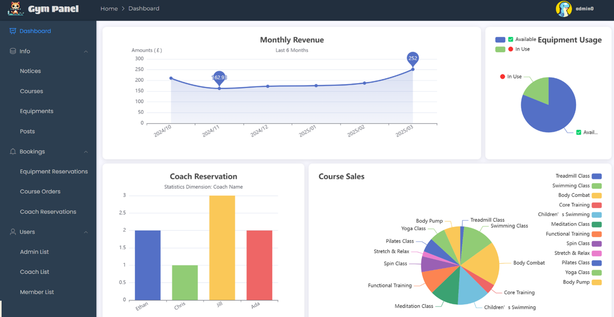 | 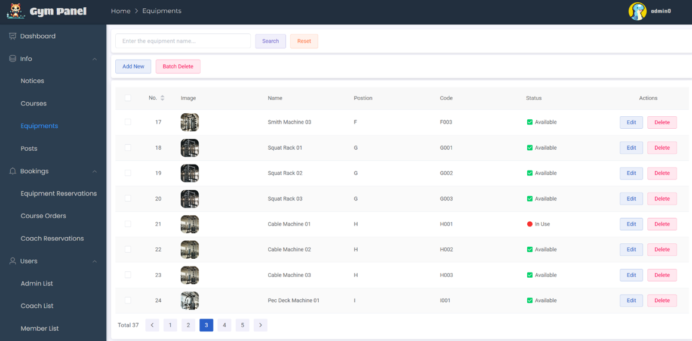 | 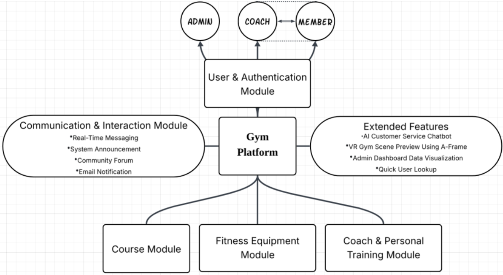 |

---

### 🤖 AI Integration & Innovation
| AI Customer Service (Spring AI) | VR Gym Preview (A-Frame) | Digital Membership Card |
| :---: | :---: | :---: |
| 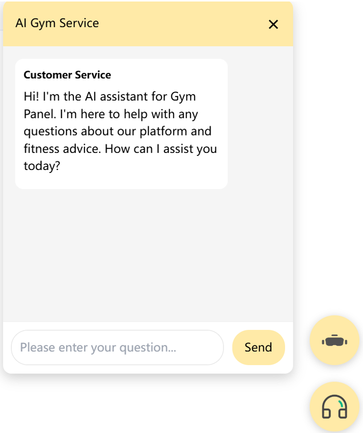 | 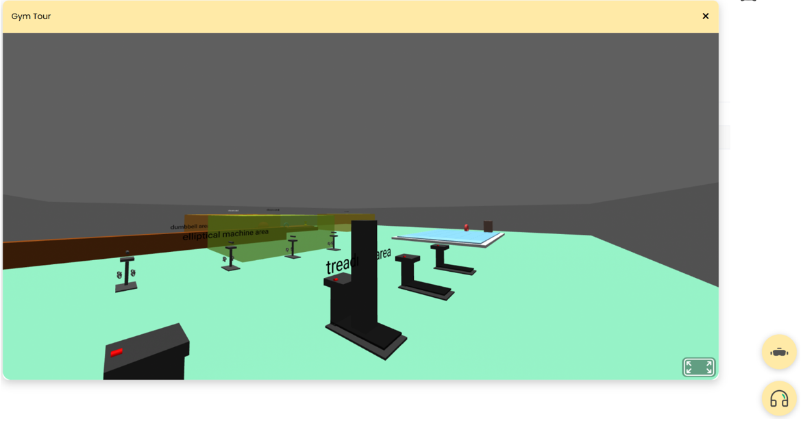 | 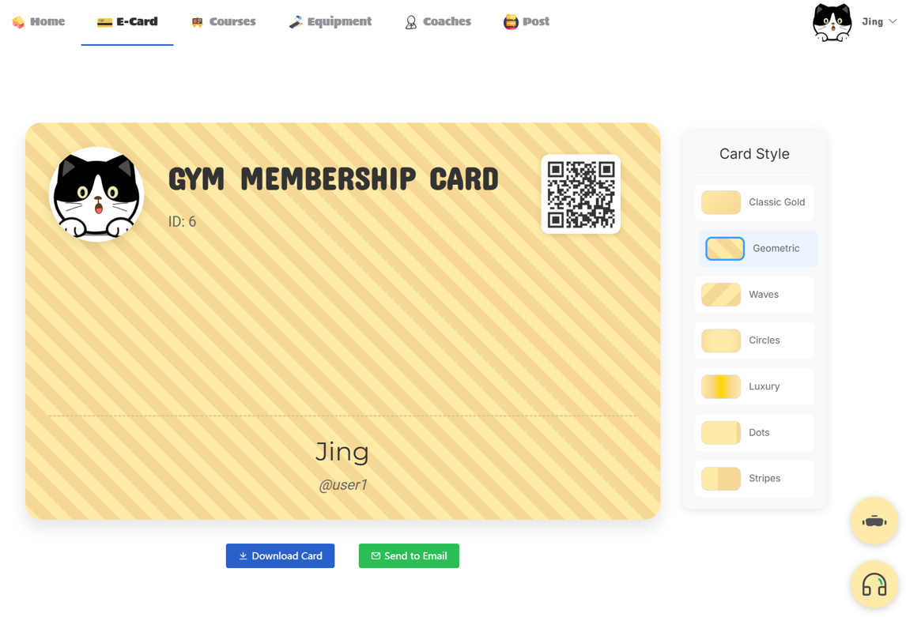 |

---

### 👤 Member & Coach Interaction
| Member Home | Course Selection | Real-time Chat (WebSocket) |
| :---: | :---: | :---: |
|  | 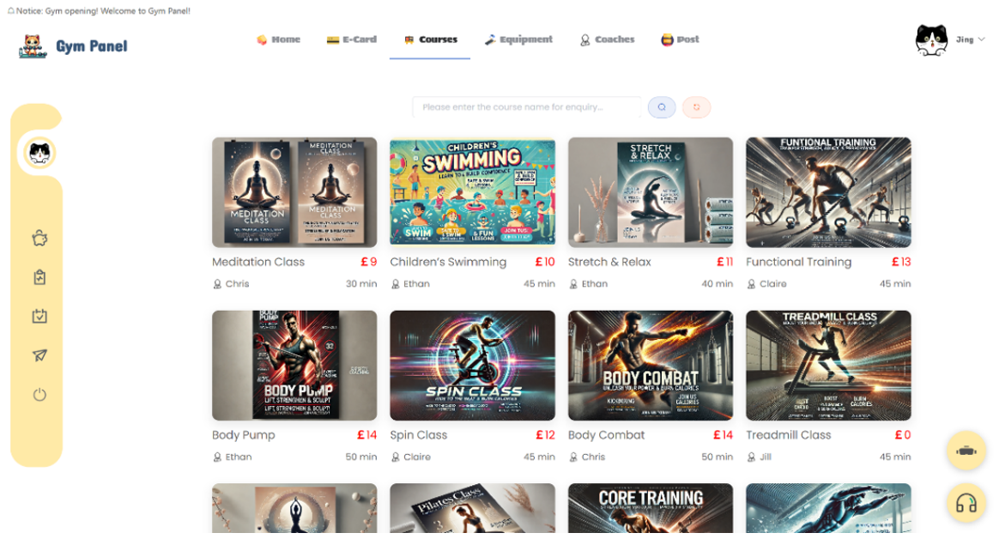 | 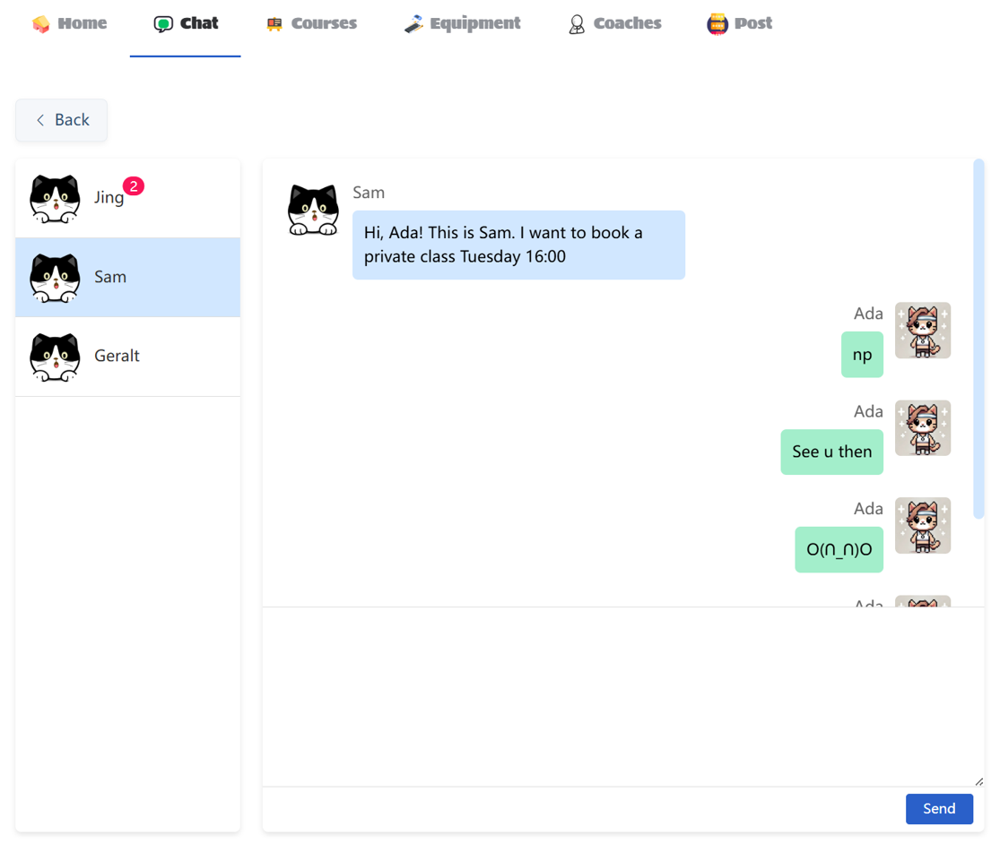 |

---

### 🔍 Else
| Course Details | E-Card Scanning | Community Forum |
| :---: | :---: | :---: |
| 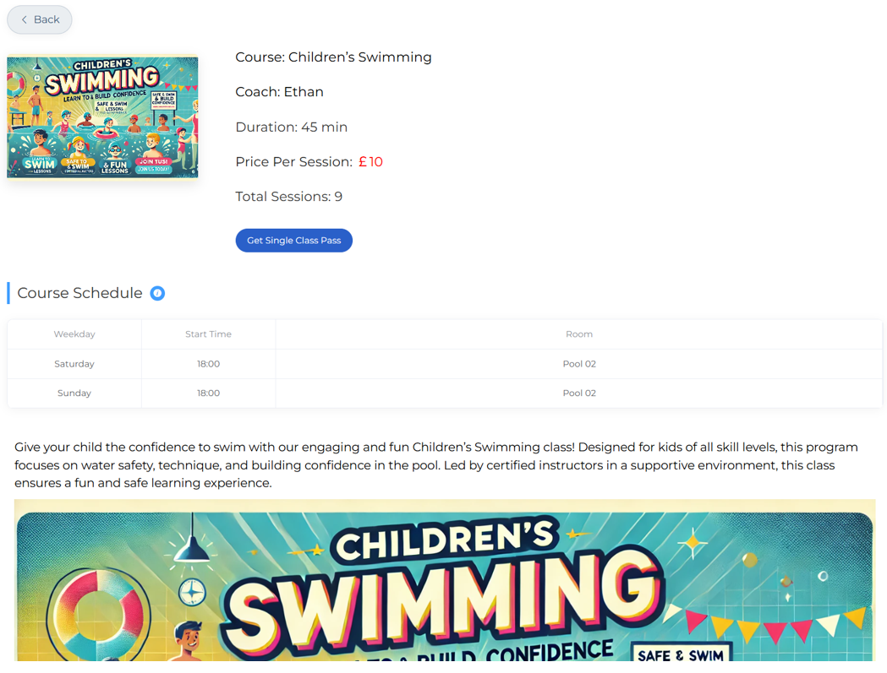 | 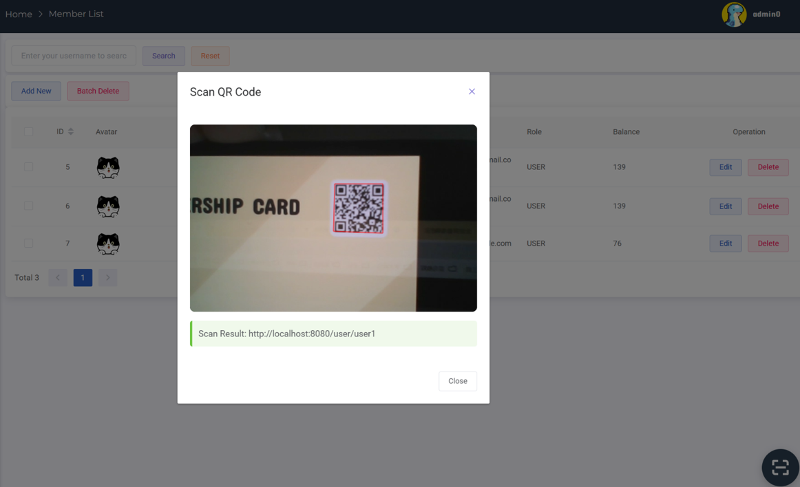 | 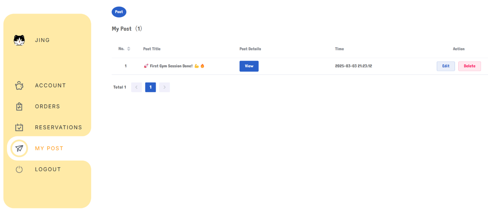 |

---
